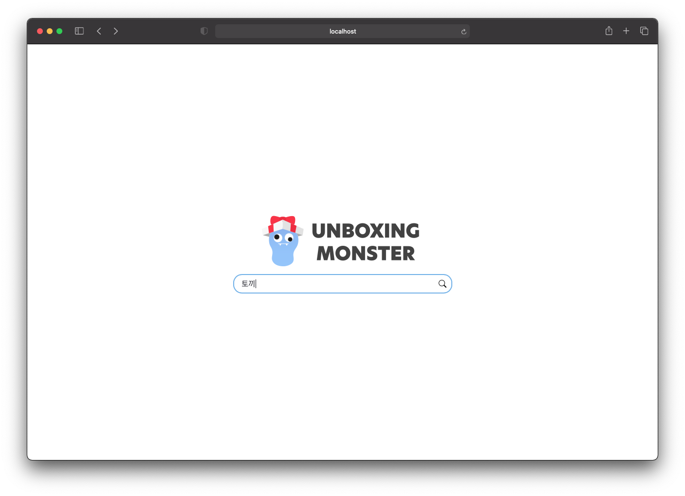
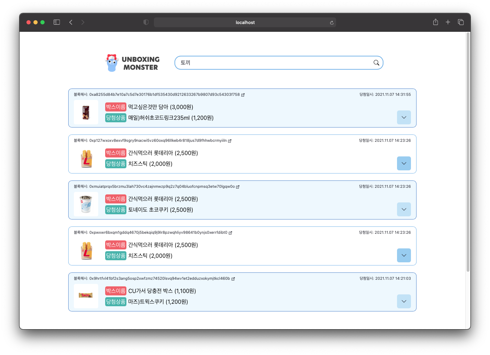

# 확률 공시 웹 

### 기능
- 블록 해시값으로 클레이튼의 블록 탐색기 (scope.klaytn.com)에서 데이터 탐색
- 실제 랜덤 값 생성에 활용된 시드 공개

### 사용 기술
- React, Typescript

### 세부 개발 내용
- React Google Charts로 확률 파이차트 구현
- Chaka UI 사용

### 실행 화면
- 메인 / 닉네임 입력

- 검색 결과

- 오픈 결과 확인

